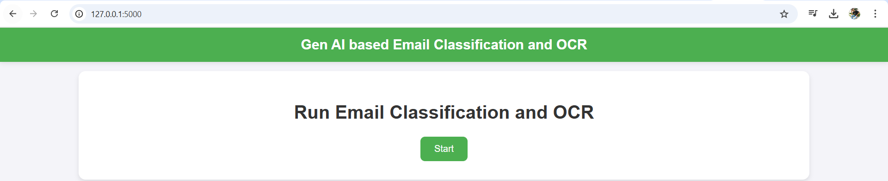
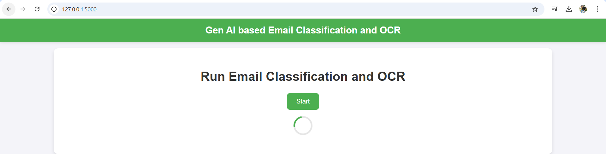
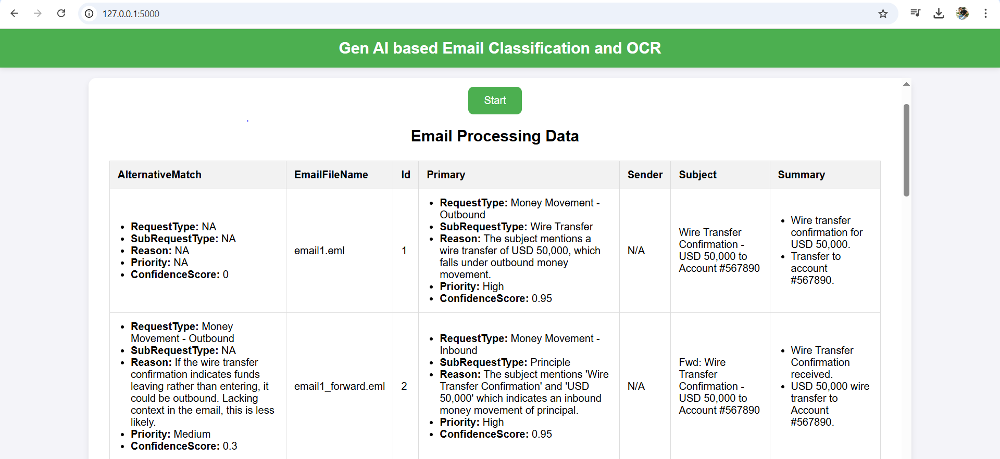
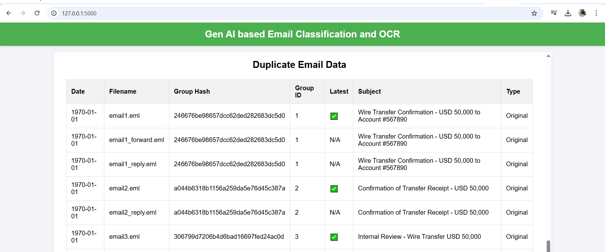

# 🚀 Gen AI-Based Email Classification and OCR

## 📌 Table of Contents
- [Introduction](#🎯-introduction)
- [Demo](#🎥-demo)
- [Inspiration](#💡-inspiration)
- [What It Does](#⚙️-what-it-does)
- [How We Built It](#🛠️-how-we-built-it)
- [How to Run](#🏃-how-to-run)
- [Project Structure](#📂-project-structure)
- [Challenges We Faced](#🚧-challenges-we-faced)
- [Tech Stack](#🏗️-tech-stack)
- [Team](#👥-team)

---

## 🎯 Introduction

**Gen AI-Based Email Classification and OCR** is an intelligent solution designed to streamline email management by leveraging advanced AI techniques. The system automates the process of classifying emails, extracting content from attachments, and identifying duplicate entries. It not only categorizes emails into predefined categories but also assigns a **confidence score** and **priority level** to ensure efficient handling.

This solution automates tedious email processing tasks, reduces manual effort, and improves overall efficiency, making it an ideal tool for organizations that handle a high volume of emails and documents.

---

## 🎥 Demo

📹 [Video Demo](https://github.com/ewfx/gaied-classifiers/tree/main/artifacts/demo/Demo_With_Text.mp4) 


🖼️ Screenshots:

  
*Landing Page - User interface to interact with the system.*

  
*Real-time processing and extraction from attachments.*

  
*Classifying emails into predefined categories.*

  
*Identifying and eliminating duplicate emails.*

---

## 💡 Inspiration

Organizations dealing with a **large volume of emails** require manual investigation for classification, intent detection, attachment analysis, and forwarding actions. This process is:

- ⏳ **Time-consuming**
- ❌ **Error-prone**
- 🧠 **Mentally exhausting**

To **automate and optimize** this workflow, we developed an **AI-powered system** that performs **real-time email classification, content extraction, and summarization**—freeing teams to focus on **critical tasks**.

---

## ⚙️ What It Does

- 📧 **Email Classification:** Classifies incoming emails into predefined categories using cutting-edge AI models.
- 📎 **Attachment Processing & OCR:** Extracts relevant information from email attachments (PDFs, images, scanned documents) using advanced OCR technology.
- 🔁 **Duplicate Detection:** Identifies and eliminates duplicate emails and attachments to avoid redundant processing.
- 🎯 **Confidence Score & Priority Assignment:** Each classified email is assigned a confidence score and priority level, ensuring critical emails receive immediate attention.
- 📝 **Summary Generation:** Generates concise summaries of email content and extracted data, enabling quick decision-making.

---

## 🛠️ How We Built It

### **Technologies, Frameworks, and Tools**

#### **Generative AI Model**
- **Google Gemini**: Used for text classification and summarization tasks.

#### **Python Libraries**
- **Tesseract**: OCR tool for extracting text from scanned or image-based PDFs.
- **PDFPlumber**: For extracting text from PDFs while preserving document structure.
- **Pandas**: Used for managing and processing email data.

#### **Web Framework**
- **Flask**: Lightweight Python framework for building the UI and API.

---

## 🏃 How to Run

1. **Clone the repository**
   ```sh
   git clone https://github.com/ewfx/gaied-classifiers.git
   cd gaied-classifiers
   ```

2. **Install dependencies**
   ```sh
   pip install -r requirements.txt
   ```

3. **Update Configuration**
   - Update `config.py` to input your **GenAI API Key for Gemini** and **Tesseract path** from your system.

4. **Ensure Emails are in the Correct Folder**
   - Make sure all emails that need to be processed are placed inside the folder:  
      - **app/Emails**
     

5. **Run the Application**
   ```sh
   python src/app.py
   ```

6. **Access the Application**
   - Open your browser and go to:
     ```
     http://127.0.0.1:5000/
     ```

7. **Start Processing**
   - Click on **Start** to begin processing emails.

---

## 📂 Project Structure

```
📦 gaied-classifiers  
├── 📂 artifacts  
│   ├── 📂 arch              # Tech architecture  
│   ├── 📂 demo              # Video Demo  
│   ├── 📂 presentation      # Presentation PPT  
│   ├── 📂 screenshots       # Screenshots  
│  
├── 📂 code  
│   ├── 📂 src  
│   │   ├── 📂 app  
│   │   │   ├── categories.xlsx      # Request Types and Sub Types  
│   │   │   ├── main.py              # Main logic  
│   │   │   ├── prompt.txt           # Prompt templates  
│   │   │   ├── 📂 DataFrames        # Folder to hold in-process CSV files  
│   │   │   ├── 📂 Emails            # Folder to store emails for processing  
│   │   │   ├── 📂 Processing        # Folder for execution process  
│   │   │   ├── 📂 util              # Utility scripts  
│   │   │   │   ├── detectDuplicate.py      # Detect duplicates  
│   │   │   │   ├── extractTextFromAttachment.py  # Extract text from email attachments  
│   │   │   │   ├── genAIProcessing.py         # General AI processing logic  
│   │   │   │   ├── processEmails.py           # Process emails  
│   │   │   │   ├── workspaceSetup.py          # Workspace setup utilities  
│   │   ├── 📂 static                # Static files (e.g., images, CSS, JS)  
│   │   │   ├── 📂 css               # CSS folder  
│   │   │   │   ├── styles.css       # Stylesheet for the project  
│   │   ├── 📂 templates             # Template files (e.g., HTML)  
│   │   │   ├── index.html           # Main HTML file  
│   │   ├── app.py                  # App entry point  
│   │   ├── config.py               # Configuration settings  
│   │   ├── requirements.txt        # Python dependencies  
├── .gitignore                     # Git ignore file  
├── LICENSE                         # Project license  
├── README.md                       # Project documentation  

```

---

## 🚧 Challenges We Faced

### **OCR Accuracy**
- **Challenge:** Extracting data from scanned or image-based PDFs often results in errors due to noise, low quality, or irregular fonts.
- **Solution:** We employed **Tesseract OCR** with pre-processing steps like image resizing and noise reduction to improve extraction accuracy.

### **Real-Time Processing**
- **Challenge:** Ensuring that emails and attachments are processed in real-time without significant delays, especially when handling large volumes of incoming data.
- **Solution:** Optimized backend processing by breaking down tasks into smaller, manageable chunks and using asynchronous processing methods to maintain performance under heavy load.

### **Handling Diverse Attachment Types**
- **Challenge:** Attachments came in many formats (e.g., PDFs, images, Word docs), each requiring different processing techniques for data extraction.
- **Solution:** Integrated multiple libraries like **PDFPlumber** for PDFs and **Tesseract** for OCR to ensure seamless extraction across formats.

### **Security Concerns**
- **Challenge:** Safeguarding sensitive email content during processing and storage, particularly when dealing with personal or confidential information.
- **Solution:** We implemented **data encryption**, used **secure servers**, and followed best practices to ensure that no sensitive data was exposed.

### **Duplicate Detection**
- **Challenge:** Identifying and removing duplicate emails and attachments, especially when emails were forwarded multiple times or included attachments in varying formats.
- **Solution:** Developed an algorithm to detect similarities in email content, subject, and attachments, enabling the system to flag duplicates effectively.

### **Ensuring Scalability**
- **Challenge:** As the system scales to handle larger volumes of emails, performance could degrade if not properly managed.
- **Solution:** We utilized **scalable cloud infrastructure** and optimized the processing pipelines to ensure smooth handling of increasing volumes of data.

---

## 🏗️ Tech Stack  
- **Frontend:** Flask (Used for building the UI and handling API requests to interact with the backend)  
- **Backend:** Python (Flask for developing the backend logic and integrating the Google Gemini model for email classification and summarization)  
- **AI Model:** Google Gemini (Generative AI model for classifying emails, summarizing content, and extracting key insights)  
- **OCR:** Tesseract (For Optical Character Recognition to extract text from scanned PDFs and images), PDFPlumber (For reading and extracting structured text from PDFs)  
---

## 👥 Team

- **Varun Bansal** (Captain) - [GitHub](https://github.com/VarunBansal126) | [LinkedIn](https://www.linkedin.com/in/varun-bansal-58345a12b/)  
- **Dipak Nayak**  
- **Kazhian Muthusami**  
- **Swarnlata Singh**  
- **Manish Pandey**  
