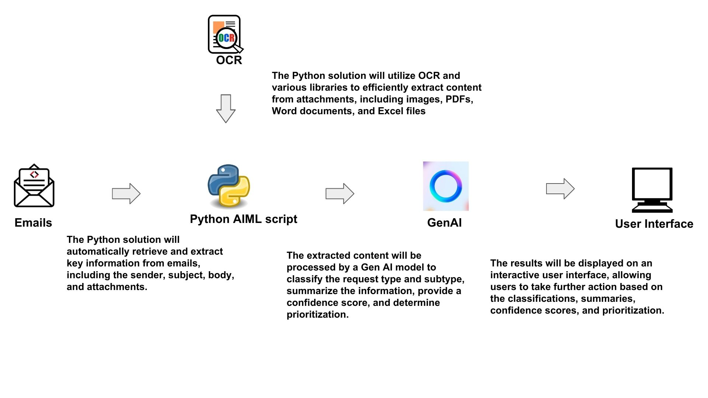
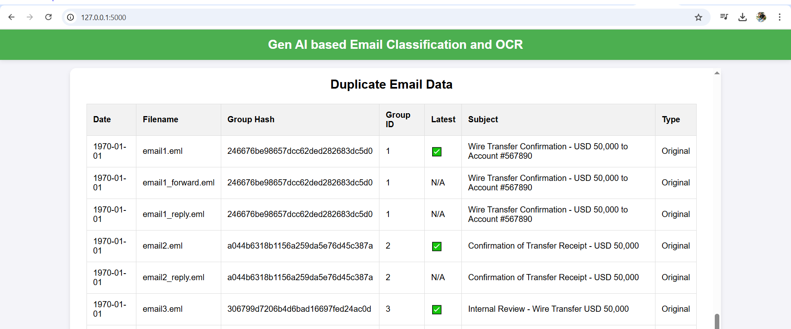

### Data Processing Flow

The data processing flow is designed to efficiently handle data from input to output while ensuring minimal delays and high accuracy. Below is the flow diagram that illustrates how data moves through the system.

Additionally, you can download the detailed presentation here:

[Download PPT](../DetailPresentation.pptx)

You can watch the demo video here:

[Watch Demo Video](../demo/Demo_With_Text.mp4)

🖼️ Screenshots:

  
*Landing Page - User interface to interact with the system.*

  
*Real-time processing and extraction from attachments.*

  
*Classifying emails into predefined categories.*

  
*Identifying and eliminating duplicate emails.*

---